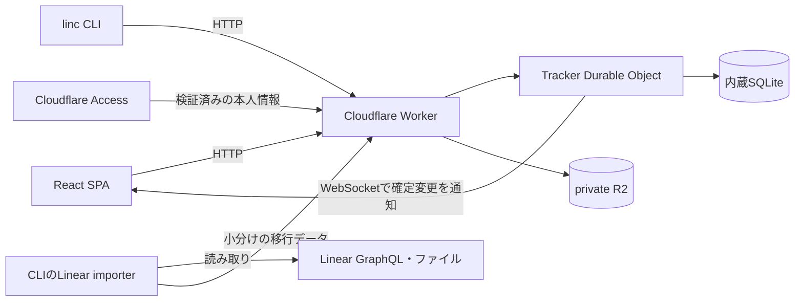

# 小規模チーム向けの構成

3〜5人がWebとCLIで同じチケットを扱う、単一インストールのアプリとして設計する。
複数のワークスペースを持てるが、不特定多数へ提供するSaaSの分散構成は採用しない。
この文書は実装前の設計判断であり、性能の達成報告ではない。

個人・チーム内での利用を前提に、発生頻度が低く手動で回復できる失敗には、明確なエラーと再試行手順で対応する。
保存済みデータの保全、認可、指定された100件同時処理は守る。
それ以外の障害をすべて自動修復する仕組みや、将来の大規模運用向けの抽象化は作らない。

## 利用者から見た操作

一覧から詳細を開いてもアプリ全体を読み直さない。
新規作成はダイアログ、ステータス・優先度・担当者・ラベル変更はその場で行う。
戻る操作では一覧のスクロール位置とフィルターを保つ。
作成・更新・削除は直ちに画面へ反映し、保存中・保存失敗・競合を区別する。
他のメンバーやCLIが確定した変更も、自分の画面へ反映する。

新しいCLIのコマンド名は `linc` とする。既存の `linear` を置き換えない。
以下は実装予定の操作例であり、現在実行できるコマンドではない。

```sh
linc auth login --url https://tickets.example.com
linc bootstrap --name Development --slug dev
linc workspace create --name Operations --slug ops
linc team create --workspace dev --key DEV --name Engineering
linc project create --workspace dev --name Website --team DEV
linc member invite --workspace dev --email teammate@example.com --role member
linc issue create --team DEV --title '検索を実装する' --description-file issue.md
linc issue update DEV-1 --state 'Human Review' --expected-version 1
linc issue list --team DEV --json
linc issue delete DEV-1 --expected-version 2
linc import linear export --output ./imports/source
linc import linear plan ./imports/source --workspace dev
linc import linear apply ./imports/source --workspace dev
linc import linear verify ./imports/source --workspace dev
```

CLIとWebは同じAPI・権限・入力検証・競合規則を使う。
CLIの表出力は人間向け、`--json` と終了コードはスクリプト向けに安定させる。

## 採用する構成



| 部分                 | 採用                                                                |
| -------------------- | ------------------------------------------------------------------- |
| Web                  | React、Vite、TypeScript、TanStack Query、クライアント側ルーティング |
| UI                   | CSS変数と画面別CSS、アクセシブルなdialog/popover部品、Lucide icons  |
| API                  | Honoを入口にしたCloudflare Worker、JSON HTTP API                    |
| 永続化               | インストール単位で1つのSQLite Durable Object                        |
| 他セッションへの通知 | Durable Objectのhibernating WebSocket                               |
| ファイル             | private R2、Workerが権限確認後に配信                                |
| CLI                  | Node.js、TypeScript、Commander、共有HTTP client                     |
| 外部入力の検証       | ZodのschemaからTypeScript型を導出                                   |
| 品質                 | pnpm、oxlint、oxfmt、TypeScript strict、Husky、lint-staged          |
| テスト               | Playwrightと実CLIプロセス、実Worker runtime、実SQLite・R2 binding   |

SPAは認証後に使う業務画面で、公開検索エンジン向けのSSRは不要。
CloudflareにはReact/ViteをWorkerへ載せる公式の構成がある。
楽観的更新には既存のQuery cacheを使い、独自の汎用同期エンジンを作らない。
[React + Vite](https://developers.cloudflare.com/workers/framework-guides/web-apps/react/)、
[Optimistic updates](https://tanstack.com/query/latest/docs/framework/react/guides/optimistic-updates)

## データの所有者を1つにする理由

`Tracker` Objectがそのインストールのワークスペース、所属、採番、チケット、変更通知の順番を所有する。
Workspaceはアプリの権限境界であり、Objectの分割境界ではない。
これにより、所属変更とアクセス確認、チケット保存と変更記録を同じトランザクションに置ける。
Objectクラスへ全ロジックを詰めず、SQLと業務規則を機能別モジュールへ分ける。

共有しなければ成立しない採番と更新順序だけを同期トランザクションで直列化する。
外部ファイルのダウンロード、アップロード、Linear API呼び出しはその外側で実行する。
WebSocketは確定変更の通知に使い、正しい最新状態はSQLiteから再取得できる。
[SQLite transactions](https://developers.cloudflare.com/durable-objects/api/sqlite-storage-api/)、
[Hibernating WebSockets](https://developers.cloudflare.com/durable-objects/best-practices/websockets/)

## チケットの保存規則

作成リクエストはクライアントで生成した `operationId` を持つ。
変更・削除はさらに読み取った `expectedVersion` を持つ。

1. Object内で現在の所属・ロール・対象の閲覧権限を確認する。
2. actorとoperationIdに対応する処理記録を調べる。
3. 同じ内容の再送なら以前のreceiptを返す。異なる内容なら409を返す。
4. 新規処理なら参照先とversionを検査する。
5. 採番、行の変更、version更新、変更記録、receiptを同じ `transactionSync` で確定する。
6. 確定後にHTTP応答と通知を返す。

再試行でも権限検査を先に行う。権限を失った人へ古いreceiptから情報を返さない。
処理記録はpayload hashと小さなreceiptを保存し、毎回本文全体を複製しない。
同じoperationIdのreceiptは不変で、現在の行は別に返すか再取得する。
タイムアウトや一時的な過負荷では同じoperationIdを再利用する。
自動再試行は上限付きとし、期限後は保存状態不明を表示する。

同じチケットの同じversionに対する競合は409にする。
100件の異なるチケットを同時更新する検証と、1件を100人分のリクエストで奪い合う検証を分ける。
後者は1件成功・99件競合が正しい。黙って最後の書き込みを採用しない。
最初の版ではフィールドごとの自動マージを行わない。

Webは同じチケットへの連続編集を順番に送る。
入力中の本文はサーバーcacheと別のdraftに持つ。
通信失敗や競合時にはdraftを残し、再送・破棄を選べる。
遅れて届いた古い応答は新しいversionを上書きしない。
削除はarchiveと別のtombstoneにし、通常一覧から隠して復元できる。
draftと送信中のcommandは開いている画面のメモリーにだけ持つ。
同じ画面内の再試行は同じoperationIdを使うが、reload後の自動再送やdraft復元は初期実装に含めない。
未保存・保存結果不明の状態で離れるときは警告し、reload後はサーバーの一覧・詳細で保存結果を確認できるようにする。
logout・所属解除時はその本人のcache・draft・未送信内容を削除する。

## 速さを作る箇所

- 一覧は小さいsummaryをページ単位で取得し、本文と履歴を一覧の初回ロードに含めない。
- 表示中の一覧・周辺チケットをcacheし、hover/focusで詳細を先読みする。
- 新規作成、プロパティ変更、削除はHTTPの往復を待たずに反映する。
- 削除確定前に戻っても対象の識別子を再利用しない。
- 確定応答で対象行と影響するフィルター結果を更新し、全画面の再取得を避ける。
- 一覧は多件数時に仮想化する。ソートとfilterはAPIで一貫した順序を定義する。
- 初期bundleからリッチエディター・管理画面・インポート処理を分離する。
- WebSocketが切れたら最後のcursor以降をHTTPで取得する。古すぎるcursorはsnapshotの再取得を要求する。

通知は対象を閲覧できるセッションにだけ届ける。
メンバー削除、private teamからの除外、トークン期限切れではその接続を閉じる。
変更はインストール全体で単調増加するsequenceを持つ。
workspaceごとの配信・取得では閲覧不能な変更とinstallation専用の変更を除外し、cursorを前へ進める。
通知を受信できなかった期間の変更と削除は、再接続で回復する。

## 認証とメンバー管理

初期構成ではCloudflare Accessを本人確認に使い、アプリ側で所属・ロールを管理する。
WorkerはJWTの署名、issuer、audience、有効期限を検証する。
単にメールアドレスのHTTPヘッダーを信用しない。
ブラウザーの更新リクエストとWebSocket upgradeにはOrigin検証も行う。
[JWT validation](https://developers.cloudflare.com/cloudflare-one/access-controls/applications/http-apps/authorization-cookie/validating-json/)

初回起動では `BOOTSTRAP_OWNER_EMAIL` を設定し、Accessで検証したメールが一致する本人だけが
`POST /bootstrap` を実行できる。最初にアクセスした人を自動的に管理者にしない。
Object内で未初期化を検査し、users、installation admin、最初のworkspaceとowner所属、
bootstrapCompleted、operation receiptを1transactionで保存する。
同じ本人・operationIdの再送は保存済み結果を返す。それ以外のbootstrapは初期化後に拒否する。
完了状態は再起動後も残る。環境変数が残っていても初期化を繰り返せない。

installation adminは新しいworkspaceの作成とinstallation管理を行う。
新規workspace作成時は作成者をownerとして同時登録する。
workspaceにはowner、admin、memberの3ロールを持つ。
ownerが初期設定・所有権移譲を行い、owner/adminがチーム・プロジェクト・招待・所属を管理する。
memberは閲覧可能なチケット・コメントを操作する。
最後のworkspace ownerと最後のinstallation adminは削除できない。
installation adminであっても未所属workspaceやprivate teamのチケットへの閲覧権限を自動付与しない。
private teamはteam membershipでも検査する。
招待されたメールアドレスとAccessの検証済み本人情報が一致した場合だけ所属を有効にする。
初期管理者以外のusersは明示的な招待の受諾時に作成する。
未登録のAccess本人は `/me` で自分の検証済み情報と招待・bootstrapの資格だけを確認できる。
Linearから移したsource identityやメールの一致だけではusersやmembershipを作らない。

CLIは `cloudflared access login` による本人確認を `linc auth login` から案内する。
アプリ用Access tokenを使い、Cloudflare管理API用の資格情報を要求しない。
cloudflaredが追加の依存になる点は受け入れる。
初期構成で独自のパスワード・passkey回復・device authorization serverを実装するより運用範囲が小さい。
[CLI authentication](https://developers.cloudflare.com/cloudflare-one/tutorials/cli/)

本番構築時にAccessの利用可否、許可する本人確認方法とメールアドレス、対象hostnameを確認する。
Access側で許可されていても、アプリに所属がなければチケットは見えない。
workers.devやpreviewの別URLから同じAPIへ認証を回避して到達できないことをテストする。
APIトークンによる非対話bot認証は初期の人間向けCLI認証とは別の追加要件とする。

## Linear互換の範囲

互換性は「既存チケットの内容と関係を移行して利用できること」と定義する。
Linearの全GraphQL mutationや `@schpet/linear-cli` の接続先をそのまま置換する互換APIは作らない。
対象はタイトル、本文、ID参照、独自status、優先度、担当者、ラベル、project、親子、関連、コメント、日時、archive、添付。
Issueに付いた `Feature` というラベルは普通のデータとして保存する。
不要と指定された追加機能群と混同して、そのラベルのチケットを除外しない。

本文の正本はMarkdownで、原本のrich-text表現も移行記録に保存する。
原本JSONはprivate R2とsource_recordsへ、取得できた変更履歴はimported_activityへ保存する。
詳細画面のactivityに、元のactor・日時を持つ読み取り専用の移行履歴を表示する。
日本語、表、チェックリスト、コードブロック、リンク、メンション、画像、折りたたみを読み取り可能にする。
未対応のrich-text構造は書き戻しで消さず、原文編集へ切り替える。
Cycles、Initiatives、Roadmap、AI Agent、分析ダッシュボード、外部連携は初期UIへ追加しない。
既存チケットのcycle等への参照は移行記録に保持し、画面機能の提供とは区別する。

インポートはローカルCLIで行う。
長時間のLinear取得をWorkerの1リクエストへ押し込まない。
LinearのAPIキーも移行先Workerに預けない。
詳細は [データとモジュール](modules.md) に定義する。
移行中は元のLinearでの編集を一時停止する運用とし、更新し続けるデータからの無停止移行は扱わない。

## 比較した構成

| 案                                      | 評価                                                                                           |
| --------------------------------------- | ---------------------------------------------------------------------------------------------- |
| 1インストールに1つのSQLite DO           | 採用。所属、採番、変更と通知の順序を同じDBに置ける                                             |
| Worker + D1 + ポーリング                | SQL運用は分かりやすい。今回は共同編集の通知と条件分岐するtransactionをDO側へ集約する方が小さい |
| workspace別DO + registry                | workspace一覧、認証、所属変更が複数Objectにまたがる。5人の規模では増える責任に見合わない       |
| Worker + Linux常駐API + SQLite/Postgres | 自宅機の稼働、回線、公開経路、復旧がサービス可用性に直結するため初期構成では不採用             |

D1でも権限や再試行を共通モジュールへ隠せるため、D1そのものが悪い選択ではない。
今回はデータ更新と更新通知を同じ所有者で扱うことを優先した。
DOの設計が負荷試験・容量・運用条件を満たせない場合は、コードを積み増す前にこの判断を見直す。

## 運用上の境界

無料運用は [調査結果](research.md) の概算に基づく見込みで、保証ではない。
索引を含む行数、Objectの稼働時間、R2容量、アカウントの他用途を計測する。
通常操作で本文や資格情報をログに出さず、operationId・所要時間・失敗種別を記録する。

データ移行はバージョン付きSQLとする。
バックアップにはSQLiteからの整合した論理export、移行原本、R2ファイルのchecksum一覧を含める。
論理exportの間だけ期限付きのmaintenance状態にして更新を停止し、読取は継続する。
全pageを取得する前に期限が切れた場合は未完了として破棄・再実行する。
R2のキーは不変にし、backup manifestが参照するファイルを削除しない。
本番導入前に空のインストールへ復元し、件数・関係・本文hash・ファイル表示を確認する。
Cloudflareの管理画面、R2 subscription、Access設定、本番URLはまだ作成・変更していない。
