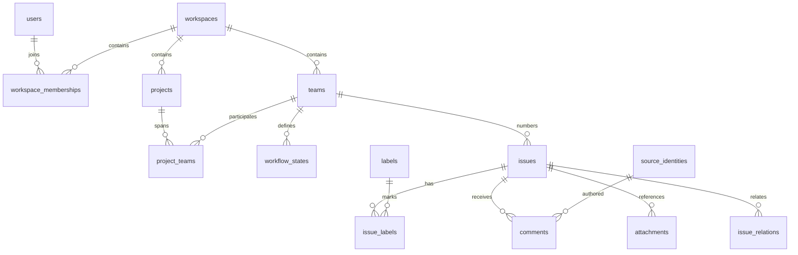

# データとモジュールの契約

これは実装予定の参照仕様。以下のディレクトリ、型、API、CLIはまだ存在しない。
採用理由は [architecture.md](architecture.md)、完了条件は [verification.md](verification.md) にある。

## 所有する知識で分割する

| 予定パス                          | 所有する責任                                                | 持たせない責任                             |
| --------------------------------- | ----------------------------------------------------------- | ------------------------------------------ |
| `packages/contracts/src/`         | API入力schema、公開レコード、エラー、cursorとreceiptの型    | SQL、React、Linear SDK                     |
| `packages/client/src/`            | HTTP呼び出し、認証付与、同じoperationIdでの再試行、応答検証 | キャッシュ、表示、業務ルール               |
| `packages/linear-import/src/`     | Linear取得、原本export、mapping、ファイル取得、再開・照合   | 本番DBへ直接書き込む処理                   |
| `apps/worker/src/http/`           | routes、入力parse、JWT検証、HTTPコード、body制限            | 採番、SQL、権限の最終判断                  |
| `apps/worker/src/tracker.ts`      | Object寿命、transaction境界、初期migration、socket再開      | 個々のCRUDの全SQL                          |
| `apps/worker/src/issues/`         | チケット、ラベル、親子・関連、コメントの規則とSQL           | HTTP、画面state                            |
| `apps/worker/src/organization/`   | workspace/team/project、所属、招待、ロール、閲覧判定        | Linearユーザーをログイン可能にする自動変換 |
| `apps/worker/src/imports/`        | 移行batchの適用、参照解決、source mapping、receipt          | 外部Linearへのアクセス                     |
| `apps/worker/src/changes/`        | 変更cursor、通知、再接続、権限変更時の切断                  | 別DBへの複製                               |
| `apps/worker/src/files/`          | R2 streaming、checksum、添付状態、閲覧判定                  | ユーザー指定URLへの自由なfetch             |
| `apps/worker/migrations/`         | テーブル、複合FK、索引、schema version                      | JavaScriptからの場当たり的なDDL            |
| `apps/web/src/features/issues/`   | 一覧・詳細・作成・プロパティ・draft                         | 独自のHTTP再試行規則                       |
| `apps/web/src/features/settings/` | workspace/team/project/member管理                           | 認証サービス自体                           |
| `apps/web/src/editor/`            | Markdown表示・編集・ファイルURL解決                         | Linearの内部データモデル全体               |
| `apps/web/src/sync/`              | Query cacheとpending edit、イベント適用、再接続             | 任意のアプリに使うoffline同期基盤          |
| `apps/web/src/ui/`                | 色・密度・dialog・menu・フォーカス・キーボード操作          | チケットの保存規則                         |
| `apps/cli/src/`                   | コマンド引数、設定、table/JSON出力、終了コード              | SQL、Webのstate                            |
| `tests/e2e/`、`tests/load/`       | ブラウザーと実CLIからの受入試験                             | モックDB、関数の呼び出し回数の検証         |

依存方向はWeb/CLI → client → contracts、Worker → contracts。
Linear importはcontractsとclientを使う。WorkerからLinear importへ依存しない。
Workerの型をCLIやWebへimportしない。
業務モジュールのSQLを汎用repository層で包まない。SQLとその制約を同じ機能の近くに置く。
package exportsとlintのimport制限で依存方向を検査する。

## データモデル



`users` は実際に認証される人。`source_identities` は移行された人・botの記録。
`identity_links` が管理者の明示mappingを持つ。
importした人に権限を付けず、退会・削除済みの人の名前も履歴から消さない。
新規author・assigneeと移行済みauthor・assigneeをdiscriminated unionで表す。

| データ               | 主なフィールド・制約                                                                                                                              |
| -------------------- | ------------------------------------------------------------------------------------------------------------------------------------------------- |
| workspace            | UUID、slug、name、archive状態                                                                                                                     |
| workspace membership | workspaceId、userId、role、active。最後のownerを守る                                                                                              |
| team                 | workspaceId、UUID、key、name、visibility、nextIssueNumber                                                                                         |
| team membership      | workspaceId、teamId、userId                                                                                                                       |
| workflow state       | workspaceId、teamId、UUID、name、type、color、position                                                                                            |
| project              | workspaceId、UUID、name、summary、description、status、lead、dates                                                                                |
| project teams        | workspaceId、projectId、teamId。projectは複数teamに所属可能                                                                                       |
| issue                | workspaceId、teamId、UUID、number、title、description、stateId、priority、assigneeRef、projectId、parentId、estimate、dueDate、sortOrder、version |
| issue lifecycle      | createdAt、updatedAt、completedAt、canceledAt、archivedAt、deletedAt。archiveとdeleteは独立                                                       |
| labels               | workspaceまたはteam scope、name、color、parent。issue_labelsで多対多                                                                              |
| comments             | issueId、body、authorRef、createdAt、updatedAt、parentCommentId、sourceRef                                                                        |
| relations            | workspaceId、issueId、relatedIssueId、type。逆向き参照も照合                                                                                      |
| attachment           | issueId、title、url、source metadata、fileRef。外部リンクと保存ファイルを区別                                                                     |
| file                 | workspaceId、checksum、size、contentType、R2 key、state                                                                                           |
| operation            | actorId、operationId、requestHash、receipt。actorIdとoperationIdが一意                                                                            |
| changes              | workspaceId、sequence、entity kind/id/version、operationId、tombstone                                                                             |
| source refs          | provider、sourceWorkspaceId、kind、sourceId、destinationId、source hash、lastImportedVersion                                                      |
| import runs/items    | export schema version、manifest hash、entity cursor、batch receipt、counts、unresolved list                                                       |

変更可能なレコードは共通してUUID、version、updatedAtを持つ。
workspace、team、project、membership、state、label、comment、attachment、file、import runにも適用する。
membershipはUUIDに加え所属先とuserの組の一意制約を持つ。
project-teamやissue-labelの集合変更は親レコードのversionを検査し、集合と親versionを同じtransactionで更新する。
採番counterもissue作成と同じtransactionで更新する内部状態であり、team設定の編集とは分ける。
operation receipt、changes、移行原本と履歴は追記専用とし、編集用versionを持たせない。
changesのsequenceはインストール全体で単調増加する共通番号とし、receiptもこの番号を持つ。
bootstrap等のinstallation操作ではworkspaceIdをnullにする。通常のworkspace変更取得からは除外する。
workspace変更cursorにはworkspaceと可視条件を結び付け、共通sequenceの途中に不可視の変更があっても進行できる。
fileの完了処理やimport runの進行もexpectedVersionで競合を検知する。

認証には `users(accessIssuer, accessSubject, verifiedEmail)`、`installation_admins(userId)`、
`installation_settings(bootstrapCompleted)`、version付きの招待レコードを置く。
issuer/subjectの組を本人の一意キーとし、メールだけで既存userを同一視しない。
招待はworkspace、メール、role、有効期限、受諾状態を持ち、受諾とmembership作成を同時に確定する。

移行の原本は `source_records(provider, sourceWorkspaceId, kind, sourceId, sourceRevision,
schemaVersion, payloadHash, rawR2Key)` に記録する。
同じsource IDの異なる取得版は不変の別原本として残し、source refsが適用した版を指す。
sourceRevisionは取得したupdatedAtとpayload hashで識別し、取得できなかった過去版を補完したとは扱わない。
private R2に置く原本JSONには、実際に取得したdescriptionState、comment bodyData、未知フィールドも残す。
原本のdownloadにも対応するworkspace・team・issueの閲覧権限を適用する。

`imported_activity` はissueId、source history ID、actorRef、発生日時、changeKind、rawSourceRefを持つ。
取得可能な状態変更等の履歴を正規化し、詳細画面でローカルの変更・コメントと時系列に表示する。
source event IDで重複を防ぎ、コメント作成イベントとコメント本文を二重に並べない。
解釈できない履歴は原本への参照を残す。runtime通知用changesを過去履歴の保管先にしない。

新規のissue descriptionはnullable Markdownとして保存する。移行時はnullと空文字も区別する。
優先度はLinearの0〜4を維持する。
workflow stateのname/typeはデータとして保存し、未知のtypeは中立の表示にする。
内部の状態判定は表示名ではなくカテゴリmappingを通す。

workspace所有データのFKはworkspaceIdを含める。
issueのstateは同じteamのものだけを受け付ける。
projectを指定する場合はproject_teamsの関係が必要。
親チケットは同一workspaceの閲覧可能なチケットとし、循環を拒否する。
private teamのチケットのタイトル・添付・関連・イベントを、権限のない人に漏らさない。

`UNIQUE(workspace_id, team_key)` と `UNIQUE(team_id, issue_number)` を置く。
空の移行先では元のteam keyと番号を保存し、その最大値の次から採番する。
既存データとの衝突はimport planで検出し、明示mappingなしに番号を変えない。
元のidentifierとpreviousIdentifiersはsource aliasとして保存する。
別workspaceの同じ `DEV-1` は異なるチケットなので、CLIのworkspace設定を必須の解決文脈とする。

索引はworkspace/teamとarchive/delete状態、更新日時/id、project、assignee、stateに合わせる。
一覧はseek paginationとし、同じupdatedAtの行はidで順序を確定する。
filter、sort、page cursorの組み合わせをcursorへ含め、不一致なら400にする。
検索はまずタイトル・identifierの部分一致を使う。日本語をASCII用のFTS tokenizerだけに任せない。

## 型と利用例

実装ではZod schemaから型を導出する。以下は責任分担を示す縮約した型スケッチ。
nullableな関連と、更新で省略したフィールドを区別する。

```ts
type Id<K extends string> = string & { readonly __brand: K };
type IssueId = Id<'Issue'>;
type WorkspaceId = Id<'Workspace'>;
type OperationId = Id<'Operation'>;
type Revision = number & { readonly __brand: 'Revision' };

type IdentityRef =
  | { kind: 'user'; id: Id<'User'> }
  | { kind: 'source'; id: Id<'SourceIdentity'> };

type VersionedRecord = { id: string; version: Revision };

type Receipt<TId extends string> = {
  operationId: OperationId;
  entityId: TId;
  version: Revision;
  sequence: number;
};

type MutationSuccess<T extends VersionedRecord> = {
  kind: 'committed' | 'replayed';
  receipt: Receipt<T['id']>;
  current: T;
};

type MutationResult<T extends VersionedRecord> =
  MutationSuccess<T> | { kind: 'conflict'; current: T };

type EditResult = MutationResult<IssueRecord>;

type EditorState =
  | { kind: 'clean'; record: IssueRecord }
  | { kind: 'editing'; base: IssueRecord; draft: IssueDraft }
  | {
      kind: 'saving';
      base: IssueRecord;
      draft: IssueDraft;
      operationId: OperationId;
    }
  | {
      kind: 'failed';
      base: IssueRecord;
      draft: IssueDraft;
      operationId: OperationId;
      error: SaveError;
    }
  | { kind: 'conflict'; current: IssueRecord; draft: IssueDraft };
```

`IssueRecord` は削除済みの場合もid・version・deletedAtを返せるレコード。
receiptは不変、`current` は応答時点の最新レコードであり、再送時に本文が過去へ戻ることはない。
公開clientのcreateはMutationSuccess、既存レコードのupdateはMutationResultを返す。
operationIdの異なる内容での再利用など、現在値を返せない409は別の構造化エラーとする。
`IssueDraft` は編集できるフィールドの集合。未保存のtitle/bodyをserver cacheに直接混ぜない。

WebとCLIは同じ公開clientを使う。

```ts
const issue = await client.issues.create({ workspaceId, operationId, input });
const result = await client.issues.update({
  workspaceId,
  issueId: issue.current.id,
  operationId: nextOperationId,
  expectedVersion: issue.current.version,
  patch: { stateId },
});
const page = await client.issues.list({ workspaceId, teamId, cursor });
```

Object内ではHTTPを持ち込まず、認証済みactorとparse済みcommandを渡す。
共通のmutation境界が認可・重複排除・transaction・receiptを所有し、issueモジュールが採番・参照・SQLを所有する。
内部関数は行または競合だけを返し、境界が成功行を公開用のreceipt付き結果へ包む。

```ts
function createIssue(
  tx: Transaction,
  scope: AuthorizedScope,
  input: NewIssue,
): IssueRecord;
function updateIssue(
  tx: Transaction,
  scope: AuthorizedScope,
  edit: IssueEdit,
):
  | { kind: 'updated'; record: IssueRecord }
  | { kind: 'conflict'; current: IssueRecord };
function listIssues(
  db: SqlReader,
  scope: AuthorizedScope,
  filter: IssueFilter,
): IssuePage;
function applyImportBatch(
  tx: Transaction,
  scope: ImportScope,
  batch: ImportBatch,
): ImportReceipt;
```

これらは同期関数。R2や外部APIのfetchを引数の準備や後処理へ分ける。
型だけで現在の所属やversionを証明せず、Object内の実データで確認する。

## HTTP契約

prefixは `/api/v1`。workspace内のリソースは `/workspaces/:workspaceId/` 配下に置く。
クライアントはactorIdやroleを指定できない。

| リソース                             | 操作                                                   |
| ------------------------------------ | ------------------------------------------------------ |
| `/me`                                | 本人とアクセス可能workspaceの取得                      |
| `/bootstrap`                         | 指定された初期管理者が最初のworkspaceを一度だけ作成    |
| `/invitations/:id/accept`            | 検証済み本人情報で招待を受諾                           |
| `/workspaces`                        | 一覧・作成。個別URLで設定変更・archive                 |
| `/workspaces/:w/teams`               | 一覧・作成。個別URLで変更・archive                     |
| `/workspaces/:w/projects`            | 一覧・作成。個別URLで変更・archive、teamとmemberの関連 |
| `/workspaces/:w/members`             | 一覧・招待・ロール変更・所属解除                       |
| `/workspaces/:w/issues`              | 一覧・filter・検索・作成                               |
| `/workspaces/:w/issues/:id`          | 詳細・PATCH・DELETE。restoreは個別操作                 |
| `/workspaces/:w/issues/:id/comments` | 一覧・作成。個別コメントで編集・削除                   |
| `/workspaces/:w/issues/:id/activity` | ローカルと移行済み履歴をcursor付きで取得               |
| `/workspaces/:w/states`、`labels`    | 一覧と管理                                             |
| `/workspaces/:w/files`               | upload開始・完了・認可付きdownload                     |
| `/workspaces/:w/changes`             | cursor以降の変更取得                                   |
| `/workspaces/:w/events`              | 認証済みWebSocket upgrade                              |
| `/workspaces/:w/imports`             | plan・run作成・batch適用・status・verify               |
| `/workspaces/:w/operations/:id`      | 自分が送った操作のreceiptを取得                        |

更新系は `Idempotency-Key`、既存レコード編集はbodyに `expectedVersion` を持つ。
bootstrapとworkspace作成のreceiptはinstallation scopeの `/operations/:id` で取得する。
複数行を変更する操作は主対象のreceiptを返す。例えば招待受諾は招待、import batchはrunのversionを進める。
400は不正入力、401は未認証、403は操作権限不足、404は対象なし・閲覧不能、409は競合。
一時的な容量超過・過負荷は成功扱いにせず、再試行可能性を構造化したエラーで返す。
CLIは競合を通常成功と異なる終了コードで返し、現在値を `--json` でも取得できる。

## インポートの契約

`export → plan → apply → verify` を別コマンドにする。
exportはraw records、対象フィールドと取得権限の情報、各connectionの完了状態、ファイル、checksum manifestをローカルへ保存する。
`.gitignore` 対象のディレクトリに置き、ファイル権限は0600、ディレクトリは0700。

| 段階            | 不変条件                                                                                           |
| --------------- | -------------------------------------------------------------------------------------------------- |
| export          | archiveを含め全pageを取得。comments/history/attachments/relationsも独立して最後まで取得            |
| plan            | team key、番号、identity、project-team関係、private team、未知フィールド、ファイル容量・欠損を表示 |
| apply entities  | 元workspaceとsource IDで重複排除。元本文と日時を保持。ユーザーの既存編集は上書きしない             |
| apply relations | 親子・関連・コメント親・元の所属情報を解決。未解決を黙ってnullにしない                             |
| apply files     | hostを検査してダウンロード、hash確認、R2へupload、最後にDB参照を確定                               |
| verify          | 件数だけでなく本文・属性・関係・ファイルhashを原本と比較                                           |

source mappingの一意キーにrunIdを使わない。
元の所属情報は移行記録として保存し、現在のworkspace/team membershipへ自動的に権限を与えない。
同じ原本を別runで再実行してもチケットが増えない必要があるため、provider/sourceWorkspaceId/kind/sourceIdを使う。
batch receiptとcursor更新はデータと同じtransactionで確定する。
移行後に編集したレコードは `lastImportedVersion` で検知し、再importの競合として残す。
移行後に削除したレコードも、再実行で勝手に復活させない。

元のMarkdownはそのまま保存する。
raw recordsはsource_recordsとprivate R2へ、取得済みのhistoryはimported_activityへ適用する。
原本hashと履歴の件数・actor・日時・対象関係をmanifestと照合する。
表示時にsource URL → destination URLの解決表を使い、本文のhash照合とリンク移行を両立する。
Linearのprivate画像はR2にコピーしてから参照を有効にする。
ファイル状態は `pending`、`ready`、`missing` の3種類とする。
upload準備でpendingを記録し、完了時にサイズとchecksumを確かめてreadyへ変える。
R2とSQLiteは同時にcommitできないため、再実行でpendingと実ファイルを照合する。
DB参照のないR2オブジェクトはorphanとして報告し、直ちに自動削除しない。
URL添付は外部リンクとして保存し、外部サイトの内容を勝手に取得しない。
partial download、redirect、HTTP 200のGraphQL error、source更新、checkpoint後の中断を扱う。

原本は単一時点のsnapshotとは限らない。
export開始・終了時刻を記録し、期間内に更新されたentityを再取得する。
最終切替時にはsourceの編集を止めた短い照合期間を設ける。
全connectionと全hashの照合が終わるまでは「移行完了」にしない。
APIから取得できない過去履歴やprivate dataは欠損一覧に残す。
